# Music Playback Architecture And Fix Plan

Ez a dokumentum a zenelejatszas, queue, playlist, repeat-list, previous, API es MobileApp osszefuggo mukodeset irja le. A cel az, hogy egyertelmu legyen, minek kell tortennie, hol tud elromlani a flow, es hol erdemes vedelmi ellenorzeseket hozzaadni.

## Jelenlegi allapot

Ket playback problema meg nyitott:

- Playlist betoltes utan a repeat-list nem a teljes betoltott playlistet ismetli, hanem csak az aktualis zenet es a meg hatralevo queue elemeket.
- A `previous` ket zene kozott tud pattogni. Pelda: `A` mar lement, `B` szol. Az elso `previous` jol visszavisz `A`-ra, de a masodik ujra `B`-t indithatja el. Elvart: `A` elotti zene induljon, vagy ha nincs, akkor `A` induljon ujra.

Megoldott playback stabilitas:

- `join` es `play` elso futasnal a bot korabban neha `lavalink is not connected` vagy `bot not in a vc` uzenetet adott, mikozben fizikailag belepett a voice channelbe.
- Ez a join utani player readiness race javitva lett: `PlayerConnectionRetryPolicy.ValidateJoinedPlayerAsync()` retry kozben a `JoinAsync` altal visszaadott playert es a guild player managerbol ujraolvasott playert is validalja.
- A celzott `PlayerConnectionService` tesztek zold allapotban vannak: 22/22 passed.

## Teljes Rendszerkep

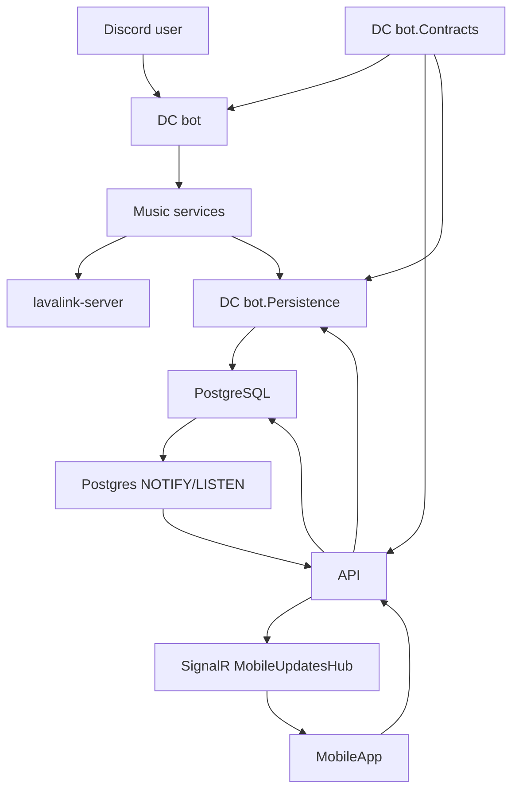

Projekt szerepek:

- `DC bot`: Discord runtime, command routing, Lavalink playback, music orchestration.
- `DC bot.Contracts`: service/repository interface-ek es kozos rekordok.
- `DC bot.Persistence`: EF Core entity-k, repository-k, migraciok, PostgreSQL realtime ertesitesek.
- `API`: HTTP vegpontok, auth, snapshotok, bot-control parancsok, SignalR realtime gateway.
- `MobileApp`: KMP app, network/data/domain/feature UI retegekkel.
- `lavalink-server`: kulso audio node, amit Lavalink4NET kezel.

## Zenelejatszas Discord Oldalon

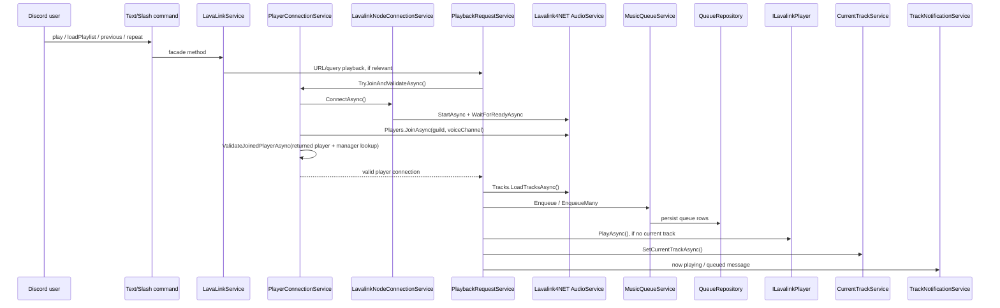

Elvart mukodes:

- `play` elott a Lavalink node legyen ready.
- Join utan a visszakapott player vagy player managerbol ujrakeresett player valid legyen. Ez jelenleg `PlayerConnectionRetryPolicy.ValidateJoinedPlayerAsync()` feladata.
- Ha nincs aktualis track, queue-bol claimelunk egy elemet es azt inditjuk.
- Ha mar szol zene, csak queue-ba kerul az uj track vagy playlist.
- Minden state valtozas menjen persistence-be, hogy API/MobileApp snapshotbol tudjon szinkronizalni.

## MobileApp Flow

```mermaid
flowchart LR
    Screen["Feature UI"] --> VM["ViewModel"]
    VM --> UseCase["Domain use case"]
    UseCase --> RepoInterface["Domain repository"]
    RepoInterface --> DataRepo["core:data implementation"]
    DataRepo --> Remote["core:network remote data source"]
    Remote --> ApiService["Ktor API service"]
    ApiService --> Backend["API endpoint"]

    Backend --> Db["PostgreSQL"]
    Db --> ApiListener["API realtime listener"]
    ApiListener --> Hub["SignalR hub"]
    Hub --> RealtimeClient["Mobile realtime client"]
    RealtimeClient --> VM
```

Elvart mukodes mobil oldalon:

- A kepernyo eloszor HTTP snapshotot ker.
- Realtime event utan refresh/snapshot alapu ujraszinkron tortenik.
- `CurrentTrackViewModel` figyel playback es queue eventekre is.
- `Previous`, `Next`, `Repeat`, `Shuffle`, `Play/Pause` mobilrol API parancsot indit, majd realtime/snapshot frissitesbol latja a vegeredmenyt.

## API Es Realtime Szerep

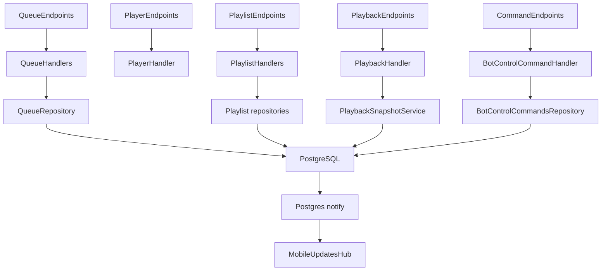

Elvart mukodes:

- Read endpointok snapshotot adnak vissza.
- Command endpointok bot-control parancsot irnak, nem kozvetlenul nyulnak Lavalinkhez.
- Bot runtime vegrehajtja a parancsot.
- Persistence realtime notifierek DB eventet kuldenek.
- API listener SignalR eventte alakitja ezt a mobil klienseknek.

## Queue Es Playback Allapotmodell

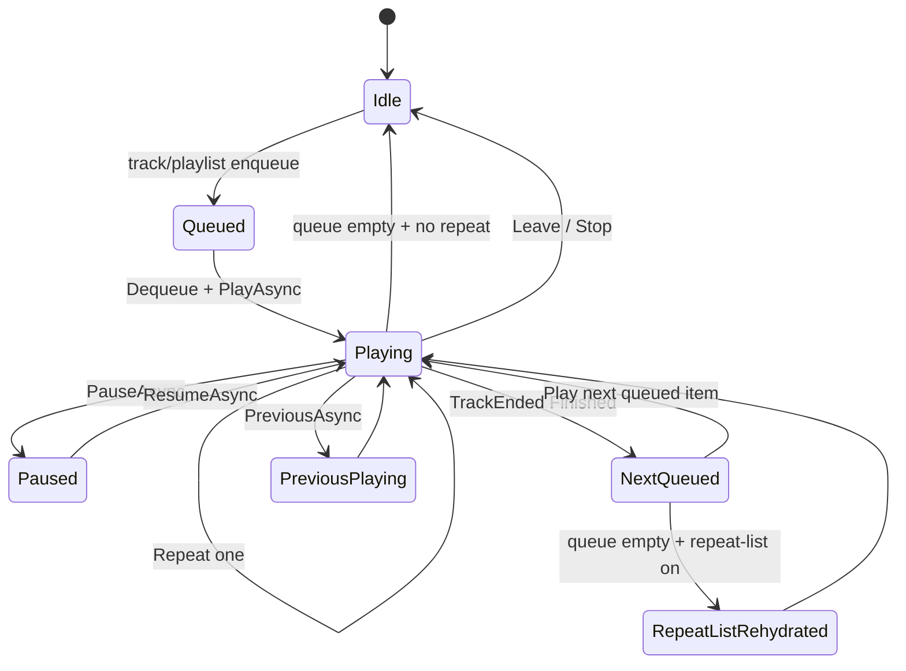

Queue item allapotok:

```text
Queued  -> hatralevo elem
Playing -> aktualisan szol
Played  -> normalisan lement
Skipped -> atlepes, clear, vagy previous miatti megszakitas
```

## Repeat-list Hiba Es Javitas

Jelenlegi hiba:

```text
Playlist: A, B, C, D
Mar lement: A
Most szol: B
Queue-ban: C, D

Repeat-list snapshot jelenleg: B, C, D
Elvart snapshot: A, B, C, D
```

Ok:

- A repeat-list snapshot jelenleg `currentTrack + queuedTracks` szemleletbol keszul.
- Emiatt ami mar `Played`, az kimarad.

Javasolt alapelv:

- A queue item `Position` legyen a playback sorrend forrasa.
- Repeat-list snapshot a relevans aktiv lejatszasi szekvencia teljes tartalma legyen: `Played + Playing + Queued`, `Position` szerint.

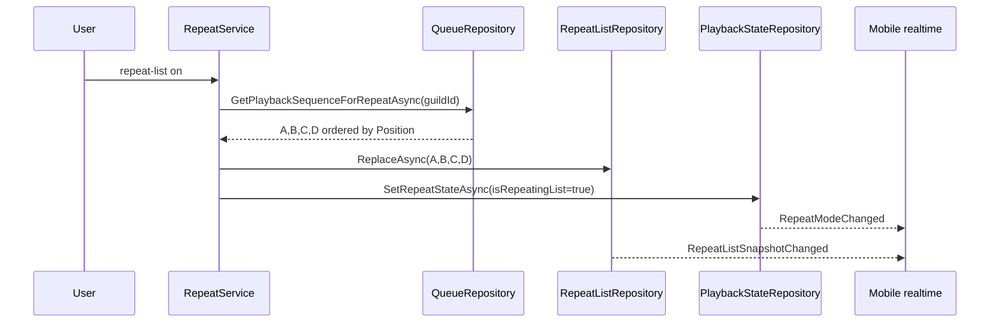

Pseudocode:

```csharp
Task<IReadOnlyList<QueueItemRecord>> GetPlaybackSequenceForRepeatAsync(ulong guildId)
{
    return guild_queue_items
        .Where(x => x.GuildId == guildId)
        .Where(x => x.State == Played || x.State == Playing || x.State == Queued)
        .OrderBy(x => x.Position)
        .ToListAsync();
}

async Task SaveRepeatListSnapshotFromQueueAsync(ulong guildId)
{
    var items = await queueRepository.GetPlaybackSequenceForRepeatAsync(guildId);
    var identifiers = new List<string>();

    foreach (var item in items)
    {
        try
        {
            var track = trackSerializer.Deserialize(item.TrackIdentifier, item.Id);
            identifiers.Add(trackSerializer.Serialize(track));
        }
        catch
        {
            logger.LogWarning("Broken queue item skipped while building repeat-list snapshot.");
        }
    }

    await repeatListRepository.ReplaceAsync(guildId, identifiers);
}
```

Tisztabb, de nagyobb modositas:

- `guild_queue_items` kapjon `PlaybackGroupId` vagy `BatchId` mezot.
- Playlist loadkor minden betoltott elem azonos groupot kap.
- Repeat-list snapshot csak az aktualis groupot menti.
- Ez megakadalyozza, hogy nagyon regi, unrelated `Played` elemek bekeruljenek a repeat-listbe.

## Previous Hiba Es Javitas

Jelenlegi hiba:

```text
A = Played
B = Playing
C = Queued

previous -> A Playing, B Skipped
previous -> repository a legnagyobb Position-u Played/Skipped elemet valasztja, vagyis B-t
```

Elvart:

```text
previous mindig az aktualis track pozicioja elotti elemet keresse.
Ha nincs korabbi elem, az aktualis induljon ujra.
```

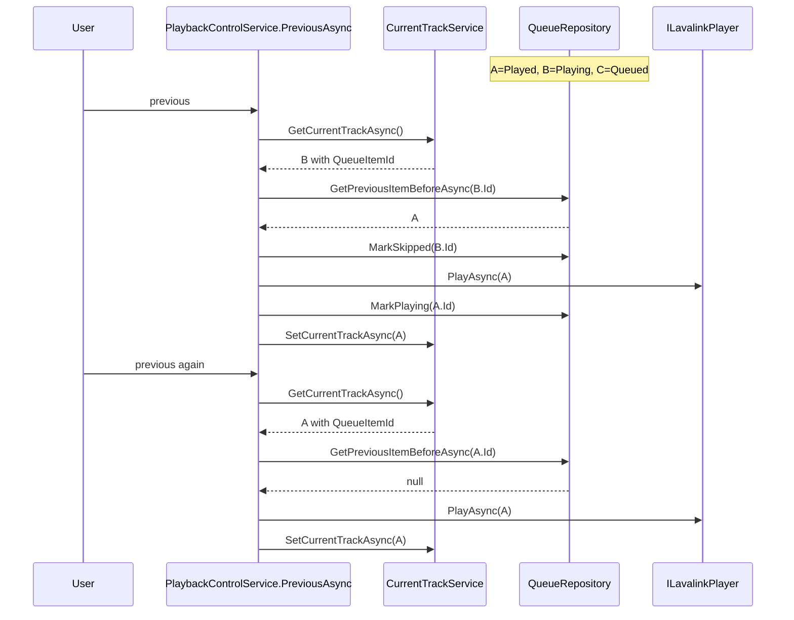

Pseudocode:

```csharp
Task<QueueItemRecord?> GetPreviousItemBeforeAsync(ulong guildId, long currentQueueItemId)
{
    var current = await GetByIdAsync(currentQueueItemId);
    if (current is null) return null;

    return guild_queue_items
        .Where(x => x.GuildId == guildId)
        .Where(x => x.Position < current.Position)
        .Where(x => x.State == Played || x.State == Skipped || x.State == Playing)
        .OrderByDescending(x => x.Position)
        .FirstOrDefaultAsync();
}

async Task PreviousAsync(...)
{
    var currentTrack = await currentTrackService.GetCurrentTrackAsync(guildId);
    var currentQueueItemId = (currentTrack as LavaLinkTrackWrapper)?.QueueItemId;

    QueueItemRecord? target;
    if (currentQueueItemId is null)
    {
        target = await queueRepository.GetPreviousItemAsync(guildId);
    }
    else
    {
        target = await queueRepository.GetPreviousItemBeforeAsync(guildId, currentQueueItemId.Value);
        target ??= await queueRepository.GetByIdAsync(currentQueueItemId.Value);
    }

    if (target is null)
    {
        notifyNoPrevious();
        return;
    }

    var targetTrack = trackSerializer.Deserialize(target.TrackIdentifier, target.Id);

    progressiveTimerService.Stop(guildId);

    if (currentQueueItemId is not null && currentQueueItemId.Value != target.Id)
    {
        await queueRepository.MarkSkippedAsync(currentQueueItemId.Value);
    }

    await connection.PlayAsync(targetTrack.ToLavalinkTrack());
    await queueRepository.MarkPlayingAsync(target.Id);
    await currentTrackService.SetCurrentTrackAsync(guildId, targetTrack, PlaybackPreviousStarted);
    await playbackStateRepository.SetPlaybackPositionAsync(guildId, TimeSpan.Zero, false, PlaybackPositionChanged);
}
```

## Join / Play Elso Hivas Hiba - Megoldva

Korabbi tunet:

```text
join vagy play elso hivas:
  bot belep voice channelbe
  valasz megis: lavalink is not connected / bot not in a vc

workaround:
  bot kirugasa voice channelbol
  ujrahivas
```

Korabbi hibas flow:

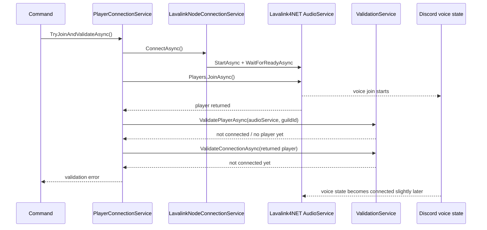

Gyokerok:

- `JoinAsync` utan a Discord voice state es Lavalink player manager nem feltetlenul azonnal konzisztens.
- `ValidatePlayerAsync` lehet, hogy a managerbol keres, mikozben a frissen visszakapott `connection` mar hasznalhato vagy par pillanat mulva lesz az.
- Stale player cleanup utan lehet egy rovid idoablak, amikor a regi player mar eltunt, az uj meg nincs teljesen felregisztralva.

Implementalt vedelmi ellenorzes:

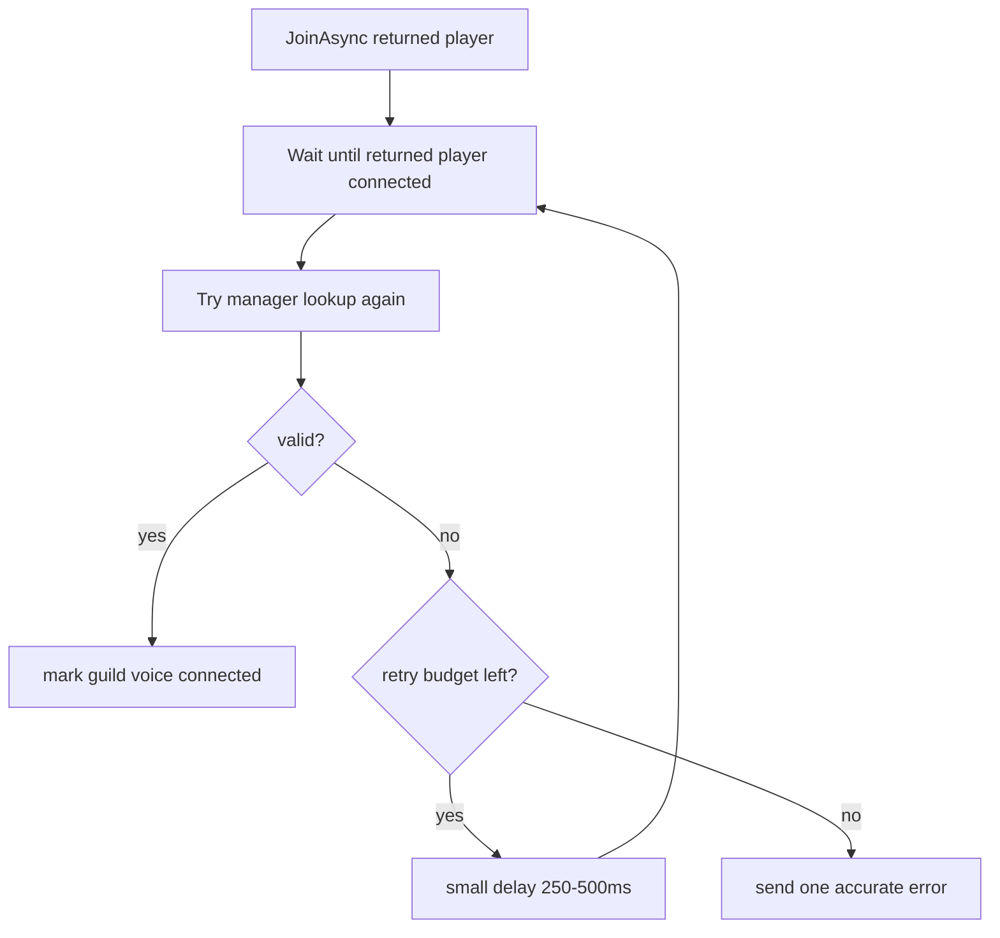

Implementalt pseudocode:

```csharp
async Task<ConnectionValidationResult> ValidateJoinedPlayerAsync(
    IAudioService audioService,
    ulong guildId,
    ILavalinkPlayer? joinedConnection,
    CancellationToken ct)
{
    for (var attempt = 0; attempt < MaxAttempts; attempt++)
    {
        if (joinedConnection is not null)
        {
            var joinedResult = await validationService.ValidateConnectionAsync(joinedConnection);
            if (joinedResult.IsValid)
            {
                return joinedResult;
            }
        }

        var managerResult = await validationService.ValidatePlayerAsync(audioService, guildId);
        if (managerResult.IsValid && managerResult.Player is not null)
        {
            var connectionResult = await validationService.ValidateConnectionAsync(managerResult.Player);
            if (connectionResult.IsValid)
            {
                return connectionResult;
            }
        }

        await Task.Delay(DelayMs, ct);
    }

    return lastValidationResult;
}
```

Valtoztatott fajlok:

- `Service/Music/MusicServices/PlayerConnectionRetryPolicy.cs`
- `Service/Music/MusicServices/PlayerConnectionService.cs`
- `DC bot tests/UnitTests/Service/Music/PlayerConnection/PlayerConnectionServiceJoinRetryTests.cs`

Verifikacio:

```bash
dotnet test "DC bot tests/DC bot tests.csproj" --filter "FullyQualifiedName~PlayerConnectionService"
```

Eredmeny:

```text
Passed: 22, Failed: 0
```

Megmaradt optionalis hardening:

- `LavalinkNodeConnectionService.ConnectAsync()` kesobb meg ellenorizheti a valodi node readiness/connectivity allapotot is, nem csak az `_isAudioServiceStarted` boolt.
- Ha `WaitForReadyAsync` sikerult, de a node kesobb megszakad/reconnectel, erdemes kulon ujra-ready checket adni.
- Sikertelen join-validacio eseten kesobb meg hozzaadhato explicit partial disconnect/cleanup, hogy semmilyen felig letrejott voice session ne maradhasson bent.

## Hol Hibasodhatnak A Flow-k

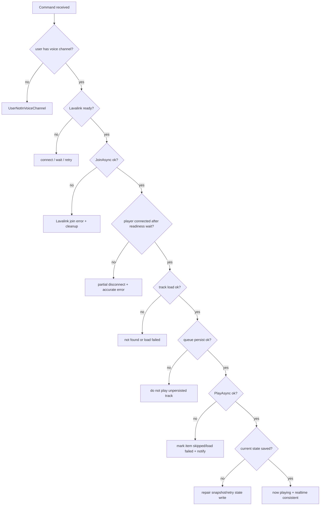

Check pontok:

- Command elejen: user voice channel, guild id, channel id.
- Lavalink elott: audio service ready, node connected, reconnect allapot.
- Join utan: returned player es manager player is ellenorizve legyen.
- Track load utan: playlist es single-track kulon ag kezelve legyen.
- Queue persist utan: csak sikeres persistence utan induljon tenyleges lejatszas.
- PlayAsync utan: current track, queue item state es playback position legyen atomikusan kozel konzisztens.
- Track ended utan: ended item state mindig `Played` vagy `Skipped` legyen, kulonben previous/repeat-list rossz alaprol dolgozik.
- Repeat-list bekapcsolaskor: snapshot ne legyen ures, ha van aktiv playback sequence.
- Mobile realtime utan: UI snapshotot frissitsen, ne csak lokalisan tippelje az allapotot.

## Konkreten Hol Javitanam

```text
DC bot.Contracts
  IQueueRepository
    + GetPlaybackSequenceForRepeatAsync(guildId)
    + GetPreviousItemBeforeAsync(guildId, currentQueueItemId)

DC bot.Persistence
  QueueRepository
    + position-alapu previous query
    + full active playback sequence query repeat-listhez

DC bot
  RepeatService
    + repeat-list bekapcsolaskor snapshot mentese queue sequencebol

  PlaybackControlService
    ~ PreviousAsync current QueueItemId + Position alapjan valasszon celt

  PlayerConnectionService
    x JoinAsync utani readiness retry megoldva: returned player + manager lookup validacio

  LavalinkNodeConnectionService
    ~ optionalis hardening: _isAudioServiceStarted mellett valodi readiness/connectivity check

  TrackEndedHandlerService
    ~ ended item state mindig legyen lezart, repeat-list rehydrate elott

MobileApp
  CurrentTrackViewModel
    ~ playback + queue realtime event utan snapshot refresh maradjon a forras
```

## Javitas Utani Repeat-list Flow

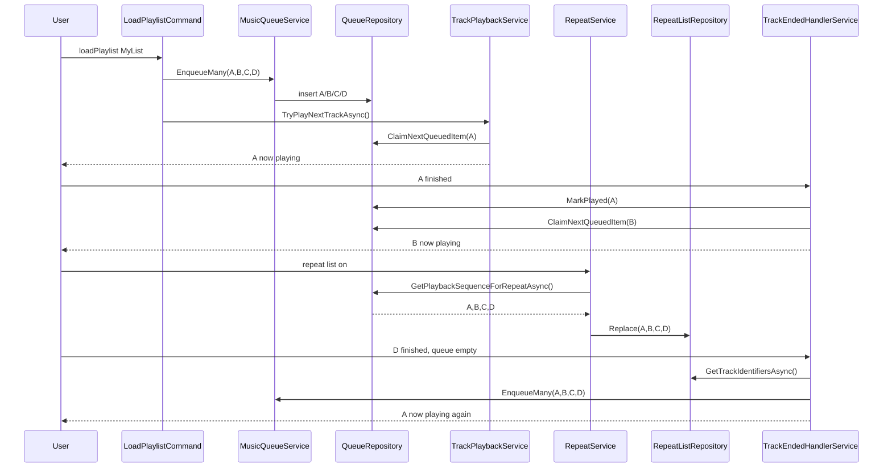

## Elfogadasi Feltetelek

- Playlist load utan repeat-list a teljes betoltott playlistet ismetli.
- Normal queue esetben repeat-list a teljes aktiv playback sequence-et menti.
- `previous` nem pattog ket track kozott.
- `previous` a lista elejen az aktualis tracket inditja ujra.
- Elso `join` / `play` utan nincs fals `lavalink is not connected` vagy `bot not in a vc`, ha a bot kozben sikeresen belepett voice channelbe. Ez a PlayerConnection retry fixszel megoldva es celzott tesztekkel verifikalva.
- Sikertelen join utan nem marad felhalott player/voice session. Ez meg optionalis hardeningkent maradt, explicit cleanup bovites kesobb javasolt.
- MobileApp `CurrentTrack` es queue nezete realtime event utan konzisztens snapshotot mutat.
